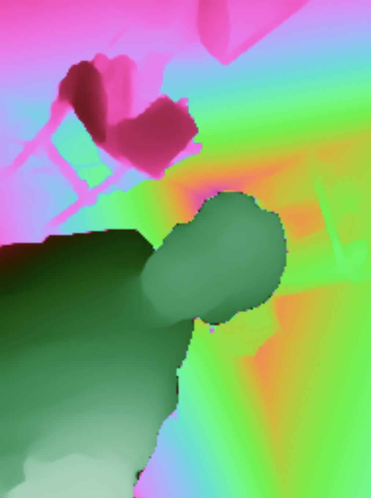
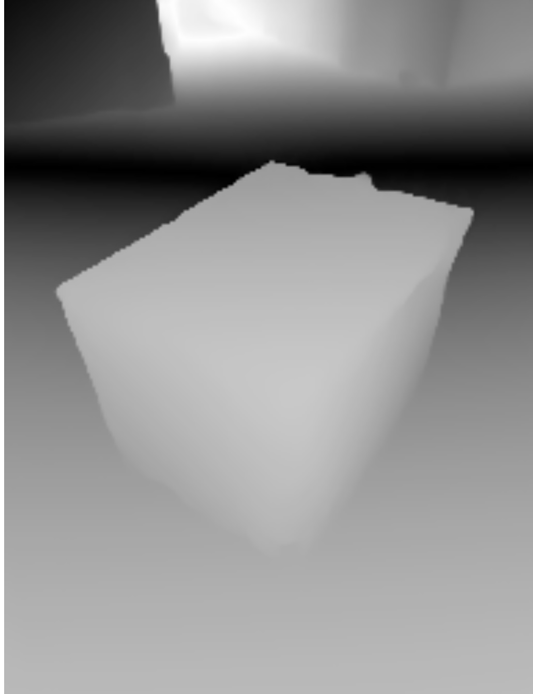

# Depth Camera For IOS

This project is for taking pictures similar to [depth maps](https://en.wikipedia.org/wiki/Depth_map) Using an Iphone. The goal is to make stylized images and videos. Cole Bennet hit me up. Also its pretty useful for navigating in the dark. 

## [Showcase](./ExampleAssets):

  

See the animated version in this [folder](./ExampleAssets) 

## IMPORTANT: [xcodeproj](./depthCamera.xcodeproj) omissions

It is important to understand which files are omitted from the repo. These files are user specific, but are needed to run the program

* depthCamera.xcodeproj/:
  * xcuserdata: This file contains user specific data.
  * project.xcworkspace: This file contains data specific to an Xcode workspace

Since these files are missing **The app will likely not function without them** to get some of your own start your own xcode project, they should be initialized by xcode according to your preferences and workspace
